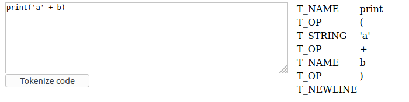
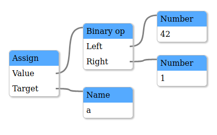

This is a package of React components for analysing and visualising working Python code,
for educational purposes.

This is still at a very early stage of development.

## Tokenizer

The tokenizer component shows the result of tokenizing Python code. The
user can edit the code and re-tokenize, to see how different code gets
interpreted by the tokenizer.

## AST visualizer

The AST visualizer will parse Python code and show the resultant parse
tree as a block diagram.

